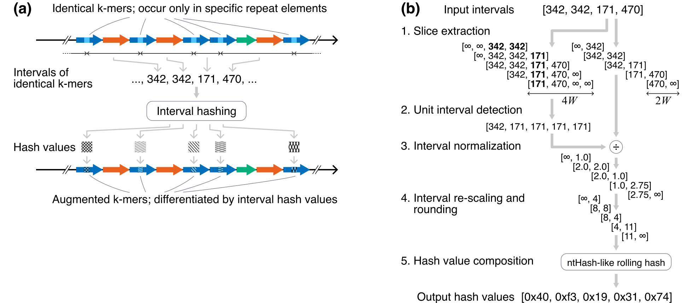
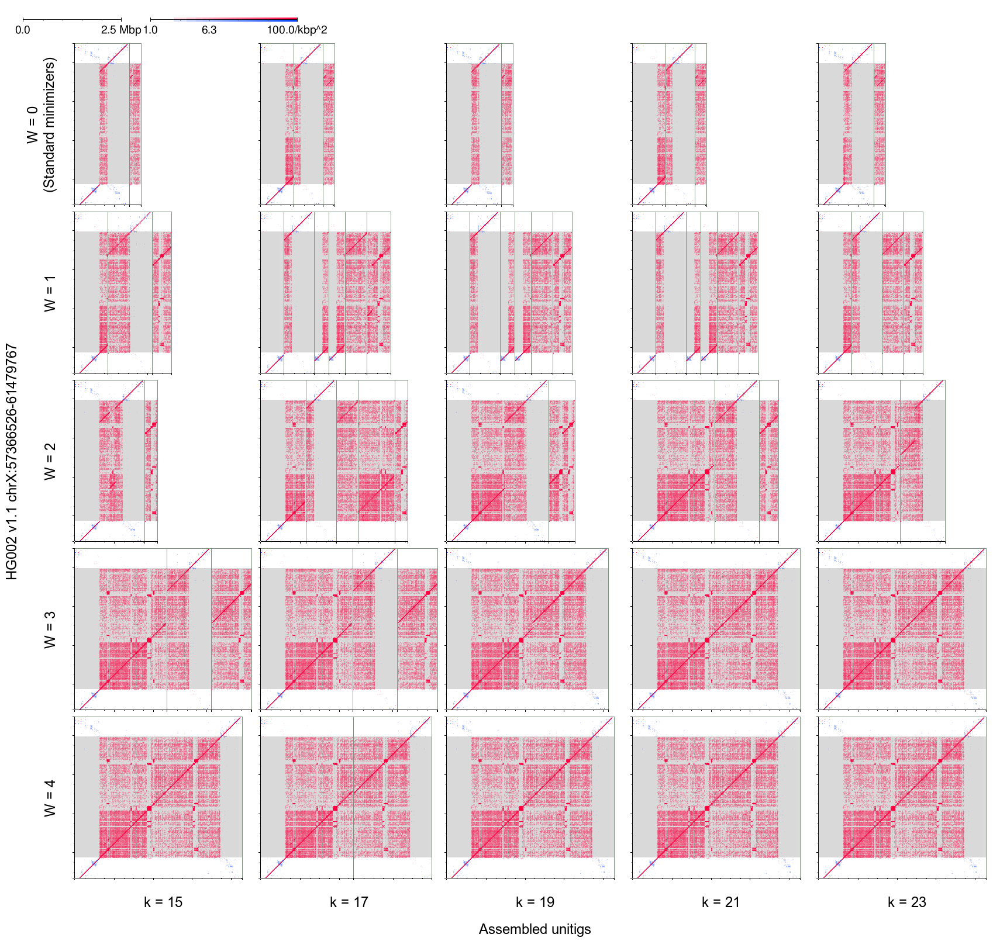

# mm2-ivh &mdash; minimap2 with interval hashing

*The original README of minimap2 is [here](./README.minimap2.md).*

## What is interval hashing?

**Interval hashing** is an algorithm that computes hash values from the **occurrence intervals of identical k-mers** on a DNA sequence. As repeats have different occurrence intervals due to their structure, the hash values serve as **effective signatures for distinguishing repeat sequences** (Fig. 1(a)).

The algorithm is characterized by a wing length parameter $W$. For a given k-mer, it encodes the occurrence intervals of $W$ identical k-mers on either side into a hash value. When combined with the original k-mer, the interval hash can be used as a key that matches only when the k-mer occurs $2W + 1$ times with identical intervals. Figure 1(b) illustrates the flow of the algorithm implemented in `mm2-ivh`. The first four steps (1-4) coarsen the interval values, and the final step (5) constructs the hash value using a rolling hash inspired by [ntHash](https://github.com/bcgsc/ntHash).



**Figure 1.** **(a)** Interval hashing encodes the occurrence intervals of k-mers into hash values, enabling the distinction of identical k-mers. **(b)** The structure of interval hashing implemented in mm2-ivh: steps 1 to 4 coarsen the occurrence intervals, and step 5 computes the hash value.

## Installation

Dependencies are the same as for the original minimap2. You will need a C compiler (like `gcc` or `clang`) and `make`. The compiled binary is named `mm2-ivh`, which is compatible with minimap2 except for the additional options specific to interval hashing.

```bash
# Clone the repository.
git clone https://github.com/ocxtal/mm2-ivh.git
cd mm2-ivh

# If you are on x86_64 architecture, just run make.
make

# If you are on ARM architecture (e.g., Apple M series), you need to specify the architecture.
make aarch64=1

# The compiled binary is `mm2-ivh`. Install it in any desired location.
cp mm2-ivh $HOME/local/bin
```

If you want to run the examples below, you may also need to install `miniasm`.

```bash
# Install miniasm.
git clone https://github.com/lh3/miniasm.git && cd miniasm
make && cp miniasm $HOME/local/bin
```

## Examples

The following commands perform a local assembly of the centromeric region of chromosome X of HG002. The filtered reads from [high-accuracy ultra-long reads provided by ONT](https://epi2me.nanoporetech.com/gm24385_ncm23_preview/) for chromosome X are placed at `data/hg002.chrX.fq`.

```bash
# hg002.chrX.fq is found in the data/ directory of this repository.
# If your system doesn't have git-lfs, install it first (i.e., if you have administrative
# privileges, brew install git-lfs or apt install git-lfs. if not, download a precompiled
# binary from https://github.com/git-lfs/git-lfs/releases and place it in a directory in
# your PATH environment variable).
# After installing git-lfs, run the following commands to download the data.
git lfs install && git lfs pull

# Do local assembly; minimizer parameters are set (k, w) = (21, 15),
# and interval hashing parameter is set W = 3.
mm2-ivh -t16 -xivh-ava-ont-ul -H -k21 --wing=3 --improved-ava=yes data/hg002.chrX.fq data/hg002.chrX.fq \
    | awk '$10 / $11 > 0.2' \
    | miniasm -h5000 -c2 - \
    > asm.k21_W3.gfa
```

Figure 2 shows the results where the minimizer length $k$ is varied from 19 to 23, and the interval hashing wing length $W$ is varied from 0 (disabling interval hashing) to 4. Increasing the wing length of interval hashing yields accurate assemblies regardless of the minimizer length $k$. In our environment, using 16 threads, the assembly took about 2.3 hours for $(k, w, W) = (21, 15, 0)$ and about 3.5 minutes for $(k, w, W) = (21, 15, 3)$.



**Figure 2.** Assemblies of the centromeric region of chromosome X of HG002 using `mm2-ivh` and `miniasm`, varying the minimizer length $k$ and the interval hashing wing length $W$. The minimizer window size $w$ was fixed at $w = 15$. Minimizers occurring 20 times or fewer in the centromeric region of chromosome X of HG002 were used for plotting. The vertical axis represents the centromeric region of chromosome X of HG002 v1.1 reference assembly. The gray shading indicates the alpha satellite HOR region of HG002. The horizontal axis shows the unitigs output by `miniasm` for each parameter. Unitigs are arranged in the ascending order of their names from left to right, and edges between them are ignored.

## Options

In addition to the options available in minimap2, the following interval-hashing-specific options are added:

* `-x ivh-ava-ont-ul`: Enables interval hashing and loads preset parameters optimized for high-accuracy (>= 99%) ONT ultra-long reads.
  * `-x ivh-ava-ont`: Aliased to `-x ivh-ava-ont-ul`.
* `--wing=INT`: Specifies the wing length $W$ for interval hashing. The preset value for `ivh-ava-ont-ul` is 3.
* `--max-ivh-span=INT`: Specifies the maximum occurrence interval (in bp) to be encoded in the interval hash value. The preset value for `ivh-ava-ont-ul` is 20000 bp.
* `--rep-flt-span`: Specifies the length (in bp) of the sliding window used for filtering locally high-frequency minimizers. The preset value for `ivh-ava-ont-ul` is 1000 bp.
* `--max-rep`: Specifies the maximum occurrence count of identical minimizers used for filtering locally high-frequency minimizers. The preset value for `ivh-ava-ont-ul` is 24.

The following options are experimental:

* `--improved-ava=yes/no`: Enables a filter to remove overlaps that can confuse `miniasm`. When this option is enabled, overlaps between the same reads are not computed (even if they are away from the main diagonal). Additionally, the maximum number of reported overlaps (controlled by `-N`) is applied per query-target pair instead of per query. Disabled by default and in the `ivh-ava-ont-ul` preset.
* `--max-overhang`: Does not report overlaps with overhangs longer than the specified length. Considered only when `--improved-ava` is enabled.
* `--min-internal`: Does not report internal matches (both reads have overhangs on both sides) shorter than the specified length. Considered only when `--improved-ava` is enabled.
* `--disable-edge-ivh`: Disables interval hashing on the query side, enabling it only on the target side. This prevents spurious matches occurring at the read ends. Disabled by default and in the `ivh-ava-ont-ul` preset.

## Limitations

Interval hashing is not effective for reads with high error rates. It likely requires a sequence identity of at least 99.5% to function effectively. This is due to the requirement that matches via interval hashing must retain all occurrences of multiple k-mers (for example, 7 occurrences when $W = 3$).

## Licenses

The code is licensed under the [MIT License](./LICENSE).
